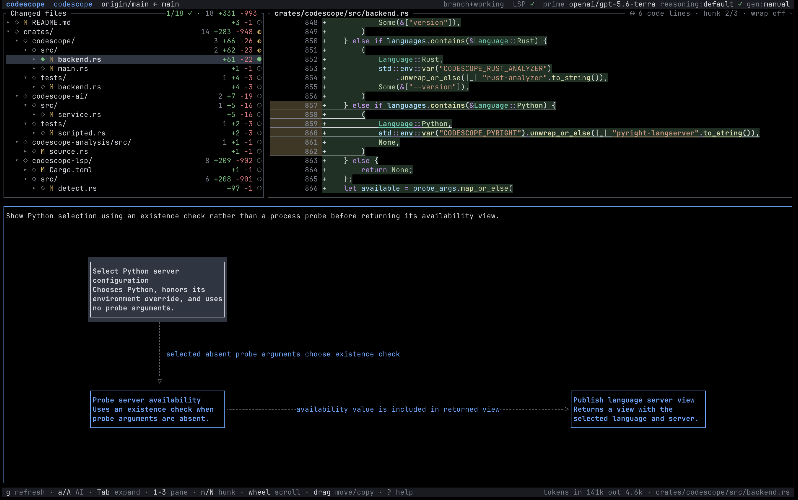

# Codescope

AI can write your PR in minutes. Reviewing it should not take hours.

Codescope builds a navigable map of any Git comparison: the changed files and symbols on the left,
the exact diff on the right, and grounded AI-generated diagrams along the bottom. Together, they
reveal what changed, how behavior flows, and where the change connects to the rest of the codebase.



## Highlights

- **Review intent, not just syntax.** Get a focused explanation of what the change does and why it
  matters.
- **Trace behavior across files.** See control flow, dependencies, branches, and system
  interactions.
- **Trust—but verify.** Every visual claim cites exact diff ranges that Codescope validates before
  display.
- **Jump straight to the source.** Navigate from diagram nodes to code, references,
  implementations, callers, and callees through built-in LSP support.

LSP navigation supports Go (`gopls`), Rust (`rust-analyzer`), and Python (`pyright`), with a
Git-only fallback.

## Installation

Codescope requires Rust 1.85 or newer. Install the prerelease from crates.io:

```bash
cargo install codescope --version 0.1.0-alpha.2 --locked
```

Or install the latest source checkout:

```bash
git clone https://github.com/DamianB-BitFlipper/codescope.git
cd codescope
cargo install --path crates/codescope --locked
```

For semantic navigation, install the language server for the repository you want to review:

```bash
go install golang.org/x/tools/gopls@latest   # Go
rustup component add rust-analyzer           # Rust
npm install --global pyright                  # Python
```

The interactive application also requires an AI provider. Set one of `PRIME_API_KEY`,
`OPENAI_API_KEY`, or `ANTHROPIC_API_KEY`, or configure an explicit OpenAI-compatible base URL by
setting `CODESCOPE_AI_BASE_URL`.

## Quick start

Open any directory inside a Git worktree:

```bash
export PRIME_API_KEY="..."
codescope
```

Codescope starts with the branch comparison. Then:

1. Move through changed directories, files, and symbols with the arrow keys or click with your mouse.
2. Press `Enter` to center the selected code in the diff.
3. Press `a` to generate a diagram for the current selection.
4. Hover a diagram box to highlight its cited lines; click it or press `Space` to expand it.
5. Press `v`, or click a review marker, to mark a directory, file, or symbol reviewed.

Press `?` at any time for the complete in-app key reference.

### Choose the comparison mode

| Key | Comparison |
|---|---|
| `s` | next: branch → branch+working → staged → unstaged → working |
| `S` | previous comparison |
| `b` | choose the branch base |
| `g` | refresh repository state and clear session AI impacts |

`branch` compares the merge base with `HEAD`; `branch+working` compares it with the worktree,
including committed and uncommitted changes. Codescope chooses a topology-aware base unless you
override it with `b`. Use `--watch` for automatic refreshes.

## The review workspace

### Changed files

Browse changes as a directory → file → LSP object tree. Use `Tab` to expand or collapse items;
selecting an LSP object centers its code, and each object remembers its diff position.

Review marks follow the tree: marking a directory or file covers its descendants, while
independently marked children stay reviewed if the parent is unmarked. Files changed after review
reset to unreviewed. `●`, `↳`, `✓`, and `◐` show explicit, inherited, complete, and partial states.

### Diff

The center pane shows the exact Git diff with LSP syntax highlighting and remembers each file’s
scroll position. Hover a diagram box to center and highlight its cited lines; click to keep that
position. Trackpad scrolling locks to the dominant axis to prevent horizontal drift.

### Impact and diagrams

When available, Impact shows callers and downstream symbols beside the diagram; otherwise, the
diagram uses the full width.

Press `a` to generate a diagram for the selection, `A` to generate as you navigate, and `m` to
change the model or reasoning effort. Codescope shows the AI’s research as it works.

Diagrams cite exact diff ranges and are checked against Git and LSP data; inferred links are marked
as such. Boxes can be moved or expanded and remember their state for the session.

## Skills

You can also drive the Codescope session with an external coding agent. Just tell it to
install the bundled Codescope skill by running `codescope skills install`, then ask it to
research the live selection or build and revise the validated diagram.

## Privacy and telemetry

Codescope keeps always-on, local-only telemetry as one owner-readable JSONL file per session beside
the global config. Nothing is uploaded.

It records UI, agent, controller, and LLM activity, tagged by origin and the active
content-addressed diff snapshot. Secrets, excluded files, authorization headers, and absolute
repository paths are scrubbed before storage. See the [telemetry contract](docs/telemetry.md) for
the complete event model.

## License

Codescope is licensed under the [Apache License 2.0](LICENSE).
